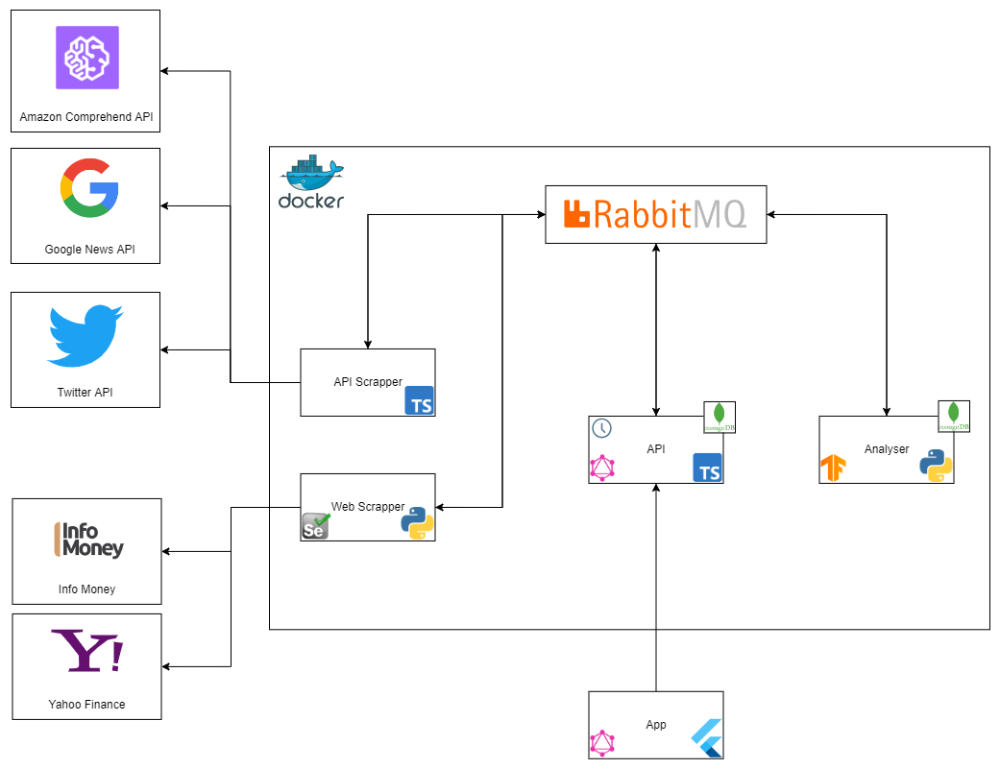

# Stock Learning
Project made during one of my classes during college to explore the microservices architecture, and also learn and apply new technologies.

## Architecture 

This project was made to create a platform were it's possible to get updated data about stock prices, and also to get predictions about buying or not a specific stock based on a deep learning model feed with those stock prices, as well as news about companies.

To achieve this, it was developed a cloud architecture that with 5 microservices having different purposes.

- API: This microservice is responsible to keep all the relevant data about predictions, stock prices and news about companies. This microservice is also responsible for scheduling and triggering web and api scraping jobs, as well as deep learning training jobs. The data maintained by this api can be fetched using it's GraphQL API. It also maintains data about users registered in the platform;
- API Scrapper: This microsservice is responsible for making requests to different types of apis to fetch data to be stored in the API microservice. Currently this microservice works with the Twitter and Google News APIs to fetch company related news and tweets. And it also works with the Amazon Comprehend API to fetch sentiment analysis about news and tweets;
- Web Scrapper: This microsservice is responsible for web scrapping different web pages to find relevant data data to be stored in the API microservice. Currently it scraps the InfoMoney and Yahoo Finance web sites to download csv data about stocks;
- Analyser: This microsservice is responsible for making predictions about stock prices based on a deep learning model during the stock market day in Brazil. During the night, it is responsible for training it's model based on the last day's data.

The communication between the different microservices happens only asynchronously through the message broker RabbitMQ.

There is also a App developed using flutter that has the purpose of providing a practical way for users to view the data and the predictions made by the Deep Learning model.

## Development repositories:
* [API](https://github.com/stock-learning/stock-learning-api)
* [API Scrapper](https://github.com/stock-learning/stock-learning-api-scrapper)
* [Web Scrapper](https://github.com/stock-learning/stock-learning-web-scrapper)
* [Analyser](https://github.com/stock-learning/stock-learning-analyser)
* [APP](https://github.com/stock-learning/stock-learning-app)
* [Lib Rabbitmq - Python](https://github.com/stock-learning/stock-learning-rabbitmq-python)
* [Lib Rabbitmq - Node JS](https://github.com/stock-learning/stock-learning-rabbitmq-typescript)
